Building reliable async workflows is tough. Users expect instant results, but your back end is juggling payments, emails, inventory updates, and more—all while networks fail and APIs flake out. One missed step can mean lost revenue or a bad user experience. Inngest makes sure nothing slips through the cracks.

> [1 min concept video here]

## Async orchestration

Modern apps rely on background processing to deliver a great user experience. When someone places an order, your system handles payments, updates inventory, sends emails, and tracks analytics—all without making the user wait. Asynchronous workflows keep your app fast and responsive, even as complexity grows.

The downside? Async systems are hard to build right. Without the right tools, you end up with a mess of callbacks, lost messages, and mystery failures. It's like managing a remote team without Slack—chaos without the right tools.

Developers traditionally rely on message queues and job processors for async work. These tools work, but they're hard to use. You need to set up servers, manage queues, track state across services, and build your own retry logic. And when things eventually break, you're on your own.

### Inngest's event-driven approach

Inngest rethinks async work by managing the hard parts for you. You focus on your workflow logic. Inngest handles the complexity and the infrastructure.

What Inngest does:

1. **Listens for events** from your app, webhooks, or schedules
2. **Decides which functions to run** based on your rules
3. **Calls your code** via HTTP when it's time to run
4. **Makes sure functions complete** with retries and state tracking

```mermaid
flowchart LR
  A[Your App] -->|Events| B[Inngest Platform]
  B -->|HTTP call| C[Step 1]
  C -->|✅ Success| B
  B -->|HTTP call| D[Step 2]
  D -->|❌ Error| B
  B -->|⏱️ Wait + Retry| E[Step 2]
  E -->|✅ Success| B
  
  subgraph G [Your Function]
    C
    D
    E
  end
  
  classDef platform fill:#4f46e5,stroke:#312e81,color:#fff
  class B platform
```



This approach offers several core benefits: **no infrastructure to manage** (servers, queues, or workers), **built-in reliability** (retries, state management, error handling), **comprehensive debugging** capabilities visibility into every step, retry, and state change.

Before we explore the key concepts that make this approach possible, let's take a quick step back and use an analogy to understand why Inngest is so powerful.

### Your app's subconscious

Think of your brain: it handles most tasks in the background without you thinking about it—regulating your heartbeat, controlling digestion, or reacting instantly to danger. It processes countless signals from your body and the world, automatically triggering the right actions at the right time. 

Your app has a similar need: it must respond to events (a user signs up, an order is placed) and trigger the right logic (send an email, update a database, process a payment) without manual intervention. 

Just like your brain ensures you keep breathing while you focus on other important tasks, Inngest ensures your app's background work happens reliably—without you having to worry about state, retries, or orchestration.  

Inngest is like the subconscious for your app: quietly handling the critical work so your core systems stay responsive, your logic stays clean, and your user experience stays smooth.


## Inngest's 3 key pillars

Inngest uses three building blocks that work together to create reliable workflows: [Events](#events%3A-things-that-happen), [Functions](#functions%3A-your-workflow-logic), and [Steps](#steps%3A-reliable-units-of-work).

### Events: Things that happen

Events are signals that trigger your workflows. Like your brain reacts to external signals, Inngest reacts to events. 
For example, your alarm clock rings at 7:00 AM—that's an event (a scheduled event)!
```ts morning.ts
const event = {
  name: "morning.alarm.rang",
  data: {
    time: "07:00",
    day: "Monday",
  },
  user: {
    id: "me",
  },
};
```

**Originate from many places:**

- **Your app**: Send events using the Inngest SDK when important things happen
- **Webhooks**: Get events from services like Stripe, GitHub, or Shopify
- **Schedules**: Run events on a schedule, like cron jobs
- **Other functions**: Chain workflows by having functions send events

Events are handy to manipulate. **Filter** them to only run functions when events match certain rules, **batch** similar events to process them together, or **transform** them by changing or adding data as they flow through.

Events create a single stream of activity across your whole system. Whether from your main app, microservices, webhooks, or schedules, all events flow through the same reliable pipeline.

### Functions: Your workflow logic

Functions are where your code lives. They define what happens when events occur. But Inngest functions aren't like normal functions. They're built for workflows that might take minutes, hours, or even days.

Following the brain analogy, a function defines what to do when the alarm event fires. Your brain has a morning routine plan—Inngest lets you write that plan as code:

```ts morning.ts
export const morningRoutine = inngest.createFunction(
  { id: "morning-routine", trigger: { event: "morning.alarm.rang" } },
  async ({ event, step }) => {
    await step.run("Get Up", async () => {
      console.log("Standing up and stretching...");
    });
  }
);
```

#### Functions characteristics

Inngest functions work differently than regular code:
- **Durable**: Steps save their state; failures resume from where they left off.
- **Event-driven**: Functions react to events, wait for events, and send events.
- **Distributed**: Steps can run across different servers or environments.
- **Reliable**: Retries are automatic; successful steps never repeat.


#### Functions patterns

Functions support powerful patterns:
- **Make decisions**: Use if-then logic based on data or results. Create branches and loops in your workflows.  
- **Call other functions**: Build small, reusable functions. Combine them into bigger workflows.  
- **Run for days**: Perfect for approval flows, scheduled follow-ups, or monitoring. The durable design means they survive server restarts.  
- **Run in parallel**: Process many items at once. Control how many run together.  
- **Handle errors smartly**: Retry steps, compensate for failures, or alert humans when needed.  

### Steps: Reliable Units of work

Steps are what make Inngest special. Each step is a unit of work that can retry on its own. But steps do more than just retry—they're how you build complex workflows.

Each step is like a task your brain handles: **Get Up**: Can't happen twice—if you already got up, you don't repeat it. **Make Coffee**: If it fails (the machine jams), you'll retry until it works. **Check Weather** → **Pick Outfit**: Steps can depend on each other's results.

Inngest automatically isolates each step, retries failures, and ensures successful steps don't rerun.

```ts morning.ts 
export const morningRoutine = inngest.createFunction(
  { id: "morning-routine", trigger: { event: "morning.alarm.rang" } },
  async ({ event, step }) => {
    // Step 1: Get up
    await step.run("Get Up", async () => {
      console.log("Standing up and stretching...");
    });

    // Step 2: Brush teeth
    await step.run("Brush Teeth", async () => {
      console.log("Brushing teeth...");
    });

    // Step 3: Make coffee (if the machine fails, retry)
    await step.run("Make Coffee", async () => {
      console.log("Brewing coffee...");
    });

    // Step 4: Check the weather
    const weather = await step.run("Check Weather", async () => {
      return fetchWeather();
    });

    // Step 5: Pick outfit based on weather
    await step.run("Pick Outfit", async () => {
      console.log(`Choosing outfit for ${weather.condition} day.`);
    });
  }
);
```

**How steps work**

Inngest runs your function step by step:

1. **First run**: Run until the first step, execute it, save the result
2. **On failure**: Retry only the failed step
3. **On success**: Move to the next step or finish
4. **Next runs**: Skip finished steps, use saved result and run the next one


**First run** - executes and saves each step:

```mermaid azdad
flowchart LR
  A[Start] --> B[Execute Step 1]
  B -->|✅| C[💾 Save Result]
  B -->|❌| D[🔄 Retry]
  D --> B
  C --> E[Execute Step 2]
  E -->|✅| F[💾 Save Result]
  E -->|❌| G[🔄 Retry]
  G --> E
  F --> H[Complete]
  
  classDef execute fill:#22c55e,stroke:#16a34a,color:#fff
  classDef retry fill:#ef4444,stroke:#dc2626,color:#fff
  classDef save fill:#6366f1,stroke:#4338ca,color:#fff
  
  class B,E execute
  class D,G retry
  class C,F save
```


**Next run** - skips completed steps, uses saved results:

```mermaid
flowchart LR
  A[Start] --> B{Step 1 Done?}
  B -->|✅ YES| C[📤 Use Saved Result]
  C --> D{Step 2 Done?}
  D -->|✅ YES| E[📤 Use Saved Result]
  E --> F[Complete]
  D -->|❌ NO| G[Execute Step 2]
  G -->|✅| H[💾 Save Result]
  G -->|❌| I[🔄 Retry]
  I --> G
  H --> F
  
  classDef skip fill:#94a3b8,stroke:#64748b,color:#fff
  classDef execute fill:#22c55e,stroke:#16a34a,color:#fff
  classDef retry fill:#ef4444,stroke:#dc2626,color:#fff
  classDef save fill:#6366f1,stroke:#4338ca,color:#fff
  
  class C,E skip
  class G execute
  class I retry
  class H save
```



This approach ensures no wasted work as successful steps never run twice. Steps consistently receive the same inputs on retries, leading to efficient runs where only necessary actions are executed. This also provides clear debugging, pinpointing exactly what failed and why.

**Step context**

Each step can access the triggering event, results from previous steps, shared function state, and your databases and APIs.
Steps have the context they need to make smart decisions while keeping your code clean and maintainable.

**Types of steps**

Inngest provides multiple step types:

<Tabs>
  <Tab title="Run" default>
    Executed in the order they're defined, with each step able to depend on the previous step's output. This enables complex workflows built with ease.    
    **Step sequence** - your function as a series of reliable units:

    
    ```ts 
    await step.run("get-up", async () => {
      return await standUpAndStretch();
    });
    await step.run("brush-teeth", async () => {
      return await brushTeeth();
    });    
    ```
  </Tab>
    <Tab title="Wait">
    Pause until an event arrives. Perfect for approval workflows, coordinating systems, and reacting to external events. 
    ```mermaid
flowchart LR
  A[Step 1] --> B[Step 2:\n Wait] --> C[⏸️ Function Paused]
  C -.->|Event Arrives| D[Step 3] -.-> F[Step N]
  C -.->|Timeout| G[❌ Continue/Error]
  
  classDef step fill:#6366f1,stroke:#4338ca,color:#fff
  classDef wait fill:#f59e0b,stroke:#d97706,color:#fff
  classDef timeout fill:#ef4444,stroke:#dc2626,color:#fff
  
  class A,D,E,F step
  class B,C wait
  class G timeout
```
    ```ts 
    const weatherData = await step.waitForEvent("wait-for-weather-update", {
      event: "morning.weather.updated",
      match: "data.location", // wait for weather in your location
      timeout: "1h", // wait at most 1 hour for weather data
    });
    ```
  </Tab>
  <Tab title="Sleep">
    Pause without blocking resources. Your function stops and restarts later. Great for:
    - Waiting for other systems
    - Adding delays between retries
    - Scheduling future work
    - Rate limiting  

    ```mermaid
flowchart LR
  A[Step 1] --> B[Step 2: Sleep]-.->|💤 Function sleeps\n5 min| D[Step 3] -.-> F[Step N]
  
  classDef step fill:#6366f1,stroke:#4338ca,color:#fff
  classDef sleep fill:#8b5cf6,stroke:#7c3aed,color:#fff
  
  class A,D,E,F step
  class B,C sleep
```
    ```ts
    // let the coffee brew for 5 minutes
    await step.sleep("let-coffee-brew", "5m"); 
    ```
  </Tab>
  <Tab title="Parallelize">
    Step pattern
    Run steps in parallel for efficiency and reduced total execution time.  
    ```mermaid
flowchart LR
  A[Step 1]
  A --> C[Step 2A]
  A --> D[Step 2B]
  A --> E[Step 2C]
  C --> F[🔄 Wait for All]
  D --> F
  E --> F
  F --> G[Step 3] -.-> I[Step N]
  
  classDef step fill:#6366f1,stroke:#4338ca,color:#fff
  classDef parallel fill:#10b981,stroke:#059669,color:#fff
  
  class A,G,H,I step
  class B,C,D,E,F parallel
```
    Example: Getting ready in parallel  
    ```ts
    const [coffeeReady, outfitChosen] = await Promise.all([
      step.run("make-coffee", async () => brewCoffee()),
      step.run("pick-outfit", async () => chooseOutfit())
    ]);
    ```
  </Tab>
  <Tab title="Conditional">
  Step pattern
    Skip or run steps based on data. Build dynamic workflows.  
    ```mermaid
flowchart LR
  A[Step 1] --> B{Condition Check}
  B -->|✅ TRUE| C[Step 2A] --> F[Step 3]
  B -->|❌ FALSE| D[Step 2B] --> F
  B -->|🚫 SKIP| E[⏭️ Skip to Step 3] --> F
  F -.-> H[Step N]
  
  classDef step fill:#6366f1,stroke:#4338ca,color:#fff
  classDef condition fill:#fbbf24,stroke:#f59e0b,color:#fff
  classDef skip fill:#94a3b8,stroke:#64748b,color:#fff
  
  class A,C,D,F,G,H step
  class B condition
  class E skip
```
    ```ts
    const weather = await step.run("check-weather", async () => {
      return await fetchWeather();
    });

    // Choose outfit based on weather condition
    if (weather.isRaining) {
      await step.run("grab-umbrella", async () => {
        return await grabUmbrella();
      });
    } else if (weather.isSunny) {
      await step.run("apply-sunscreen", async () => {
        return await applySunscreen();
      });
    }
    // If neither condition, skip to next step
    ```
  </Tab>
    <Tab title="Rollbacks">
    Define undo steps that run when later steps fail.  
    ```mermaid
flowchart LR
  A[Step 1] --> B[Step 2] --> C[❌ Step 3 Fails]
  C --> D[🔄 Undo Step 2]
  D --> E[🔄 Undo Step 1]
  E --> F[🚨 Failed]
  
  classDef step fill:#6366f1,stroke:#4338ca,color:#fff
  classDef fail fill:#ef4444,stroke:#dc2626,color:#fff
  classDef rollback fill:#f97316,stroke:#ea580c,color:#fff
  
  class A,B step
  class C,F fail
  class D,E rollback
```
    ```ts
    try {
      await step.run("make-coffee", async () => {
        return await brewCoffee();
      });

      await step.run("toast-bread", async () => {
        return await toastBread();
      });

      // This step fails
      await step.run("prepare-eggs", async () => {
        throw new Error("Out of eggs!");
      });
    } catch (error) {
      // Rollback in reverse order
      await step.run("cleanup-toaster", async () => {
        return await putAwayToaster();
      });
      
      await step.run("turn-off-coffee", async () => {
        return await turnOffCoffeeMachine();
      });
      
      throw error; // Re-throw to mark function as failed
    }
    ```
  </Tab>
</Tabs>


Steps transform Inngest from a job queue into a workflow engine. By breaking work into retryable units, you get reliability without complexity.

## It's all about developer experience

### Build with great tools

Inngest gives you a complete toolkit for building and running workflows:

- **SDKs**  Build workflows in JavaScript/TypeScript, Go, and more.
- **CLI**  Test, run, and manage workflows from your terminal.
- **Dashboard**  Visual UI to view, debug, and manage workflows.
- **REST API**  Automate and integrate with Inngest from other systems.
- **Local development**  Run and test everything locally before deploying.
- **Integrations**  Connect with services like GitHub, Slack, Stripe, and more.

Everything works together—so you can go from idea to production, fast.

### Control the flow

Shape how and when your workflows run. Optimize performance, reliability, and cost. Inngest provides built-in primitives for:  

**<Icon icon="arrows-to-circle" /> Concurrency**  
Control how many steps or functions run at the same time. Prevents overloading downstream systems or APIs. For example, you can limit a step to only run 5 instances in parallel.  

**<Icon icon="gauge-min" /> Throttling**  
Slow down processing to avoid spikes or to match external rate limits. Throttle workflows to process a certain number of events per second or minute.  

**<Icon icon="hand" /> Rate limiting**  
Enforce strict limits on how often a function or step runs, ensuring you never exceed third-party quotas or internal policies. For example, only send 100 emails per minute.  

**<Icon icon="ranking-star" /> Priority**  
Assign priorities to different workflows or events, so urgent work is processed first. Lower-priority tasks can be delayed or paused during busy periods.

Inngest makes it straightforward to configure these controls in code or via the dashboard, so you can adapt to changing business needs without rewriting your workflows.

### Observe and manage

Know exactly what's happening in your workflows, and stay in control:

- **Monitoring & metrics**  See workflow status, run counts, and error rates in real time.
- **Step-level logs & data**  Inspect every step's inputs, outputs, and timing.
- **Function replay**  Re-run workflows with the same data for straightforward debugging.
- **Workflow control**  Pause, cancel, or retry runs with a click or API call.
- **Debugging tools**  Trace events, step through workflows, and find issues fast.

You get built-in visibility and tools to manage every aspect of your async work—no extra setup or plugins required.

**Inngest gives you the tools to build, test, and operate workflows—plus the observability to know what's happening at every step.**


## Recap: Inngest vs the rest
Inngest provides a modern alternative to traditional message queues like Kafka or RabbitMQ, focusing on event-driven orchestration with built-in reliability and state management. Here's how Inngest compares to conventional message queues:

| Feature            | Message queues                | Temporal                                      | Inngest                                         |
|--------------------|------------------------------|-----------------------------------------------|-------------------------------------------------|
| Event-driven       | <Icon icon="check" iconType="solid" /> Yes      | <Icon icon="check" iconType="solid" /> Yes    | <Icon icon="check" iconType="solid" /> Yes      |
| Durable execution  | <Icon icon="check" iconType="solid" /> Yes      | <Icon icon="check" iconType="solid" /> Yes    | <Icon icon="check" iconType="solid" /> Yes      |
| State management   | <Icon icon="xmark" iconType="solid" color="red" /> No | <Icon icon="check" iconType="solid" /> Yes    | <Icon icon="check" iconType="solid" /> Yes      |
| Built-in retries   | <Icon icon="check" iconType="solid" /> Basic    | <Icon icon="check" iconType="solid" /> Advanced| <Icon icon="check" iconType="solid" /> Advanced |
| Delivery guarantee | <Icon icon="triangle-exclamation" iconType="solid" color="orange" /> Varies | <Icon icon="check" iconType="solid" /> Yes    | <Icon icon="check" iconType="solid" /> Yes      |
| Flow control       | <Icon icon="xmark" iconType="solid" color="red" /> Manual | <Icon icon="check" iconType="solid" /> Built-in| <Icon icon="check" iconType="solid" /> Built-in |
| Monitoring         | <Icon icon="triangle-exclamation" iconType="solid" color="orange" /> External | <Icon icon="triangle-exclamation" iconType="solid" color="orange" /> External| <Icon icon="check" iconType="solid" /> Built-in |
| Developer experience | <Icon icon="triangle-exclamation" iconType="solid" color="orange" /> Moderate | <Icon icon="triangle-exclamation" iconType="solid" color="orange" /> Moderate| <Icon icon="check" iconType="solid" /> Excellent |
| Complexity        | <Icon icon="xmark" iconType="solid" color="red" /> High | <Icon icon="triangle-exclamation" iconType="solid" color="orange" /> Medium | <Icon icon="check" iconType="solid" /> Low      |
| Infrastructure   | <Icon icon="xmark" iconType="solid" color="red" /> Requires setup | <Icon icon="xmark" iconType="solid" color="red" /> Requires setup | <Icon icon="check" iconType="solid"/> Zero setup |

## Now, it's your turn to build

Ready to build better async workflows? Install the SDK for your language, create your first function, and explore our examples and best practices.

- **Interactive tutorial**: Build a complete order processing workflow
- **Architecture guide**: Learn how Inngest works under the hood
- **Migration guide**: Move existing queue workflows to Inngest
- **API reference**: Complete documentation of all features

Inngest changes how we build async, event-driven apps. Start building more reliable workflows today—your future self will thank you.